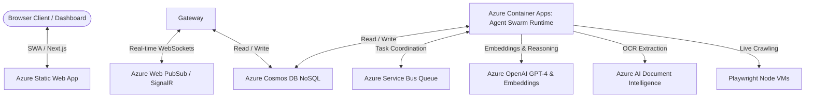

# Microsoft Azure Integration & Setup Guide

This guide describes how to configure Ajax OS to run dynamically using your Microsoft Azure cloud account services instead of the mock local JSON database (`db.json`) and simulated tool outputs.

---

## Architecture Overview

To transition Ajax OS to a fully cloud-native application, the mock layers in this monorepo map directly to Microsoft Azure services:



---

## 1. Database Layer: Azure Cosmos DB (NoSQL)

By default, the shared database client in [db.ts](file:///d:/Ajay/Projects/AjaxAI/packages/shared/src/db.ts) falls back to reading/writing `db.json`. To connect to a live Azure Cosmos DB instance:

1. Create a **Cosmos DB Account** in Azure:
   * API: **NoSQL**
   * Capacity Mode: **Serverless** (recommended for hackathons)
2. In the Cosmos DB sidebar under **Settings**, click **Keys** and copy the **Primary Connection String**.
3. Create a Database named `AjaxAI` and create the following containers (with partition key `/id`):
   * `users`, `objectives`, `tasks`, `subtasks`, `agentRuns`, `agentMessages`, `memories`, `documents`, `knowledgeNodes`, `knowledgeEdges`, `opportunities`, `approvals`, `intentSignals`, `intentRecoveries`, `weeklyReflections`, `notifications`.
4. Modify `@ajaxai/shared/src/db.ts` to connect via the `@azure/cosmos` SDK using your connection string:

```typescript
import { CosmosClient } from "@azure/cosmos";

const client = new CosmosClient(process.env.AZURE_COSMOS_CONNECTION_STRING!);
const database = client.database("AjaxAI");
// Replace Collection.list() and operations using container.items.query(...)
```

---

## 2. Intelligence Layer: Azure OpenAI Service

To power the swarm's planners, validators, and intent modeling agents, replace simulated mocks with live GPT-4 and text-embedding model instances:

1. Provision **Azure OpenAI Service** in your resource group (using the location specified in your bicep deployment).
2. Go to **Azure OpenAI Studio** and deploy two models:
   * **GPT-4** (Model Deployment Name: `gpt-4`)
   * **Text-Embedding-3-Small** (Model Deployment Name: `text-embedding-3-small`)
3. Copy the **Endpoint URL** and **API Key** from the **Keys and Endpoint** sidebar menu.
4. Map these in your background swarm runtime environment.

---

## 3. Real-time Gateway: Azure Web PubSub (WebSockets)

To support real-time WebSocket notifications and live log updates without client-side polling:

1. Provision an **Azure Web PubSub** instance (Standard tier).
2. Go to **Key/Connection String** settings and copy the Connection String.
3. Configure backend SignalR WS server to upgrade requests through the Azure PubSub service hub using the Azure Web PubSub SDK.

---

## 4. Environment Variables Specification

Create `.env` files in both `services/backend/` and `services/agent-runtime/` directories containing the following credentials:

```ini
# Core Configuration
PORT=3001
NODE_ENV=production

# Database Layer
AZURE_COSMOS_CONNECTION_STRING="AccountEndpoint=https://cosmos-ajaxai.documents.azure.com:443/;AccountKey=...;"

# AI Swarm Reasoners
AZURE_OPENAI_KEY="your-azure-openai-api-key"
AZURE_OPENAI_ENDPOINT="https://openai-ajaxai.openai.azure.com/"
AZURE_OPENAI_GPT_DEPLOYMENT="gpt-4"
AZURE_OPENAI_EMBEDDING_DEPLOYMENT="text-embedding-3-small"

# Real-time WebSocket Gateway
AZURE_WEB_PUBSUB_CONNECTION_STRING="Endpoint=https://pubsub-ajaxai.webpubsub.azure.com;AccessKey=...;Version=1.0;"

# Tool Engines
AZURE_AI_DOC_INTEL_ENDPOINT="https://docintel-ajaxai.cognitiveservices.azure.com/"
AZURE_AI_DOC_INTEL_KEY="your-document-intelligence-key"
OUTLOOK_CONNECTION_STRING="your-office-365-smtp-connection-string"
```

---

## 5. Deployment Commands

Execute the script from the project root to compile TypeScript code, seed initial models, and launch resources:

```bash
# 1. Compile TypeScript workspaces
npm run build

# 2. Seed initial Cosmos DB datasets
npm run seed

# 3. Spin up all services concurrently locally (with Azure configs active)
npm run dev
```

For full Azure deployment, log in and run:
```powershell
cd infra
./deploy.ps1
```
This deploys Azure Cosmos DB, OpenAI (GPT-4 and Embeddings), Azure Static Web Apps for your Next.js Command Center, and Service Bus, securing secret keys directly inside Azure Key Vault.
